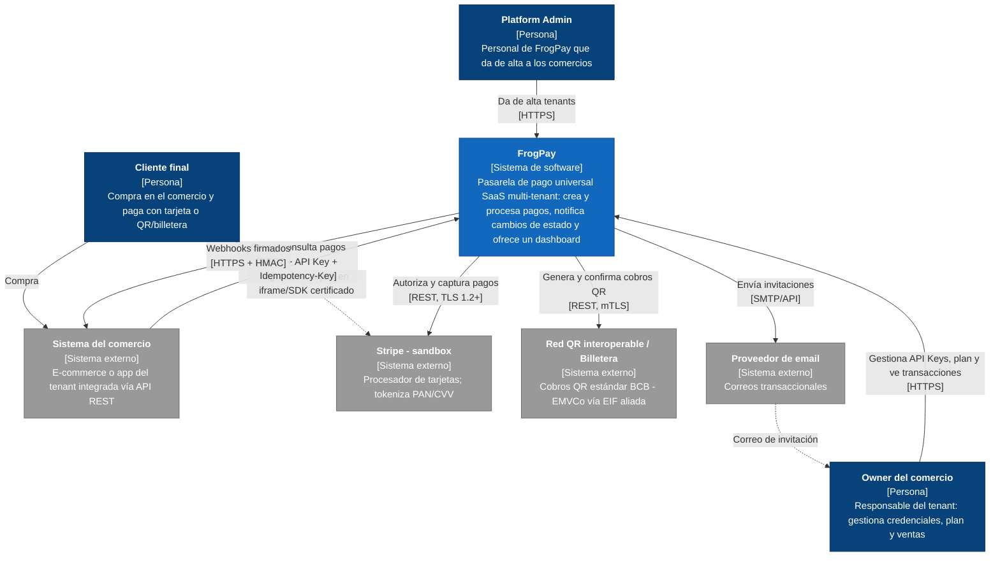
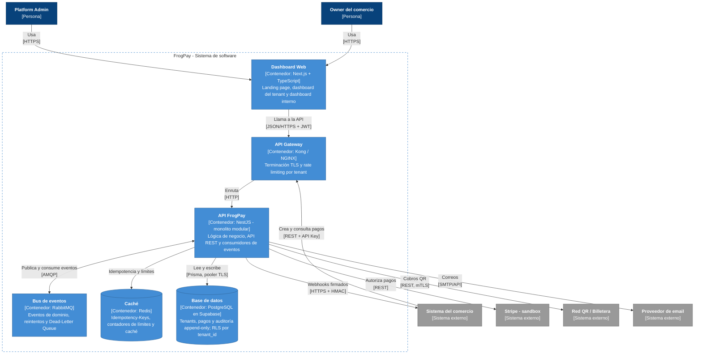
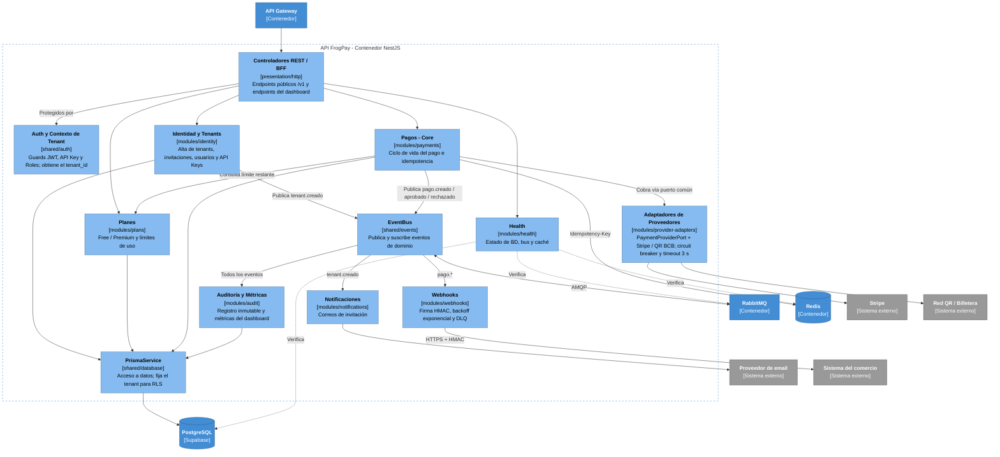

# Diagramas C4 — FrogPay

Modelo C4 de la arquitectura de FrogPay (MVP): **Monolito Modular Orientado a Eventos (EDA)**.

| Nivel | Pregunta que responde |
|---|---|
| 1. Contexto | ¿Quién usa FrogPay y con qué sistemas externos se comunica? |
| 2. Contenedores | ¿Qué aplicaciones y almacenes de datos componen FrogPay? |
| 3. Componentes | ¿Cómo está organizada internamente la API? |

**Leyenda:** azul oscuro = persona · azul = sistema/contenedor de FrogPay · celeste = componente · gris = sistema externo · línea punteada = relación secundaria o de verificación.

---

## Nivel 1 — Diagrama de Contexto

**Decisiones reflejadas**
- **PCI DSS (RNF-04):** el cliente final ingresa su tarjeta directamente en el iframe/SDK del proveedor. FrogPay nunca recibe el PAN ni el CVV, lo que reduce el alcance de auditoría de SAQ D a SAQ A.
- **Interoperabilidad BCB:** los cobros QR usan el estándar interoperable (EMVCo) a través de una EIF aliada, sin esquemas QR propietarios.
- **Alta controlada de tenants (HU-01):** solo el Platform Admin crea comercios. El owner se activa mediante un correo de invitación.

---

## Nivel 2 — Diagrama de Contenedores

**Decisiones reflejadas**
- **Monolito modular (ADR-001):** un solo contenedor de API agrupa todos los módulos, incluidos los consumidores de eventos. Esto evita la sobrecarga operativa de microservicios en el MVP, y cada módulo puede separarse en su propio contenedor en el futuro.
- **RabbitMQ (ADR-002):** desacopla la respuesta síncrona (menos de 300 ms, RNF-01) de las tareas pesadas: webhooks, auditoría y correos.
- **PostgreSQL + RLS en Supabase (ADR-003):** base compartida con aislamiento por fila según `tenant_id` (RNF-03).
- **Redis:** guarda las Idempotency-Keys con TTL de 24 h (RF-06) y los contadores de límites por plan.
- **Entorno de desarrollo:** `docker-compose.yml` levanta Dashboard, API, Redis y RabbitMQ; la base de datos vive en Supabase. El API Gateway se incorpora en el despliegue de staging/producción.

---

## Nivel 3 — Diagrama de Componentes (API FrogPay)

**Decisiones reflejadas**
- **Comunicación por eventos:** los módulos no se llaman entre sí directamente. Identidad y Pagos publican eventos, y Notificaciones, Webhooks y Auditoría los consumen de forma asíncrona. La única llamada síncrona entre módulos es Pagos → Planes (límite restante), a través de un servicio exportado.
- **Extensibilidad (RF-16, RNF-07):** Pagos solo conoce `PaymentProviderPort`. Agregar un proveedor nuevo significa agregar un adapter, sin tocar el core.
- **Resiliencia (RNF-08):** los adaptadores aplican timeout de 3 s y circuit breaker. Los webhooks reintentan con backoff (1-2-4-8-16 s) y, al agotar los reintentos, pasan a la DLQ.
- **Aislamiento multi-tenant (RNF-03):** el `tenant_id` se obtiene siempre del JWT o la API Key (componente Auth), y `PrismaService` lo fija en la sesión de PostgreSQL para que RLS filtre cada consulta.
- Cada componente corresponde a una carpeta real del repositorio (ver `apps/api/README.md`).
